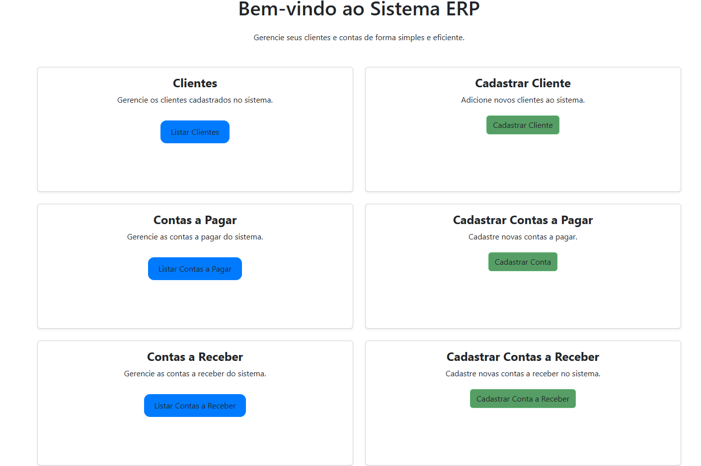
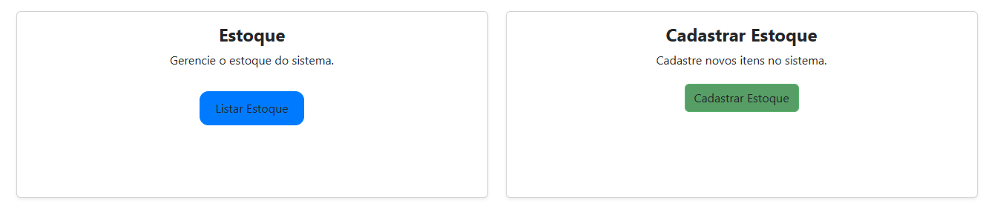
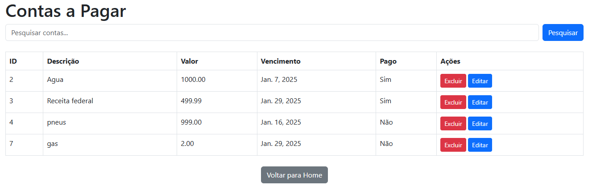

# Sistema  de controle de contas a pagar, receber, clientes e estoque
<h1>ERP</h1>

<h2> 1--> Baixe o projeto</h2> 
<h2> 2--> Utilize os seguintes comandos!
        
2.1- sudo apt install python3-pip

        
2.2- sudo apt install python3-venv

        
2.3- python3 -m venv env

        
2.4- source env/bin/activate

<h2> 3--> Instale as dependências do projeto "pip install -r requirements.txt"</h2>  
<h2> 4--> Inicie o projeto "python manage.py runserver" e abra no navegador http://127.0.0.1:8000/ </h2> 

        
        
        

